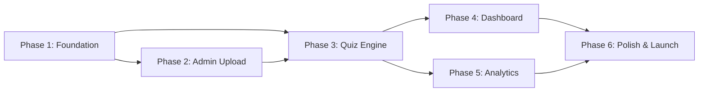

# MdcatXpert — Development Phases Overview

> 6-week execution plan for a solo founder, ~5 hours/day.

---

## Phase Map

| Phase | Focus                              | Week | Document                                                  |
| ----- | ---------------------------------- | ---- | --------------------------------------------------------- |
| 1     | Foundation — Setup, DB, Auth       | 1    | [phase-1-foundation.md](./phases/phase-1-foundation.md)   |
| 2     | Admin Excel Upload & Papers        | 2    | [phase-2-admin-upload.md](./phases/phase-2-admin-upload.md)|
| 3     | Quiz Engine                        | 3    | [phase-3-quiz-engine.md](./phases/phase-3-quiz-engine.md) |
| 4     | Student Dashboard                  | 4    | [phase-4-student-dashboard.md](./phases/phase-4-student-dashboard.md)|
| 5     | Analytics & Insights               | 5    | [phase-5-analytics.md](./phases/phase-5-analytics.md)     |
| 6     | Polish, Testing & Beta Launch      | 6    | [phase-6-polish-and-launch.md](./phases/phase-6-polish-and-launch.md)|

---

## Dependency Graph

---

## Key Rules

1. **No phase should start before its dependencies are complete**
2. **Each phase has clear acceptance criteria** — check them off before moving on
3. **Mobile-first** — test on mobile at the end of every phase, not just Phase 6
4. **Ship early** — Phase 6 is about launching, not perfecting
